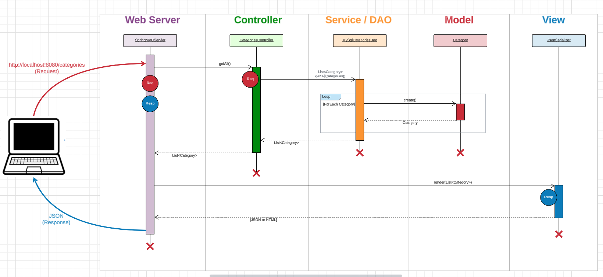

# Easy-shop-E-commerce-store

### Over view of the project
This project is a an online E-commerce store. The client server of the project is ready. My role in this project is to create the backend server to make the website full-stack. I created the backend of the project using Java spring boot to connect the API and to allow the client to fetch from the server. The client will send API request's to the server and the server will get the data that the client is asking for and return it. In this project the backend server is allowing user's to login/register as either (User, admin) using tokens that is unique to each user/admin. Below is a diagram of the backend MVC pattern.

## Diagram

([Link for diagram](https://lucid.app/lucidchart/0d55c612-f50c-4b17-9621-9e9d3adc7cc4/edit?viewport_loc=-1201%2C-1369%2C2994%2C1452%2C0_0&invitationId=inv_c38d4138-bce2-4911-960d-0b76ab51be17))

## Phase 1

Implemented all CRUD operation's for the category's controller using REST API's. The server recieves a localhost:8080 protocall to the categorys controller. The controller proccess the call and calls a function in the categoriesDao class depending what type of call it is,(GET, POST, PUT, DELETE) and who is making the call (admin or user).

## Phase 2

Implemeted all CRUD operations for the products and made responses for all the api filter protocalls, allowing user to search by category, price range, and also color. Also added admin tools like, create product, update, and delete product.

## Phase 3