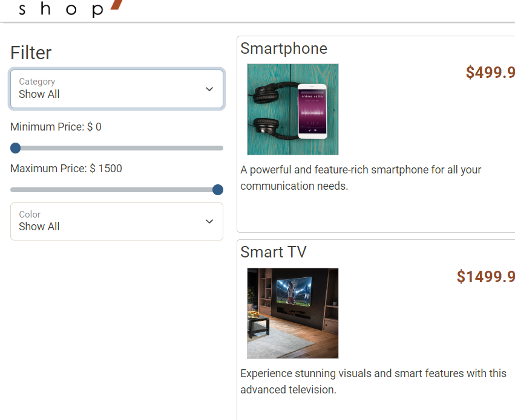
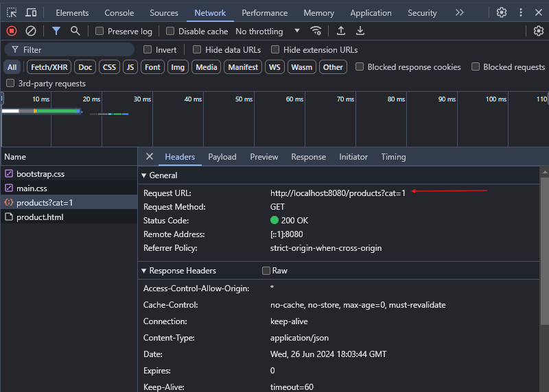
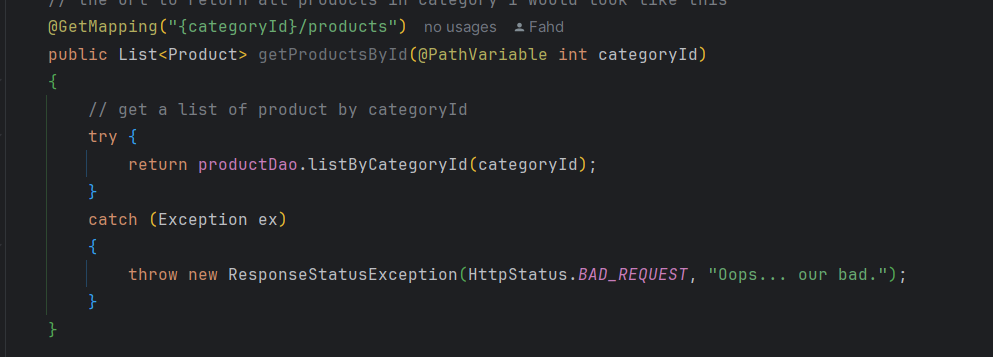
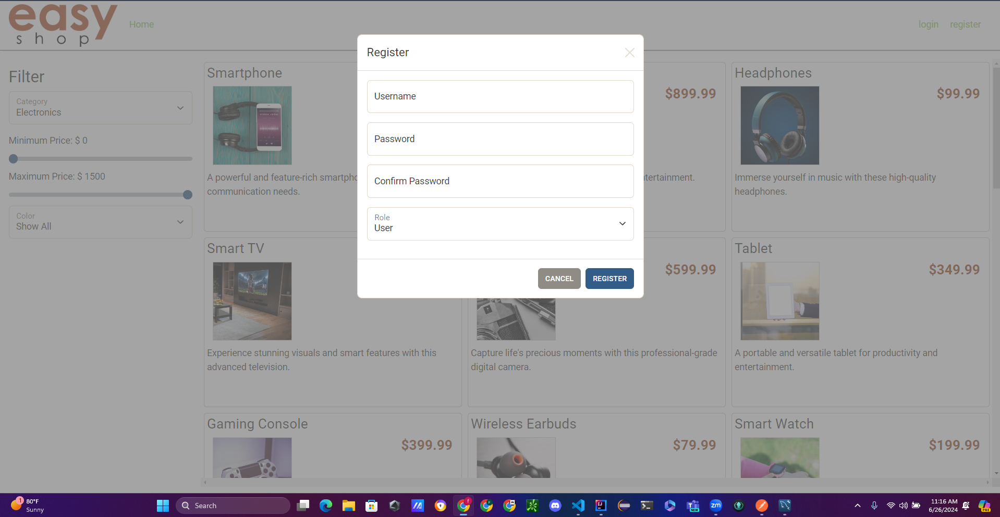
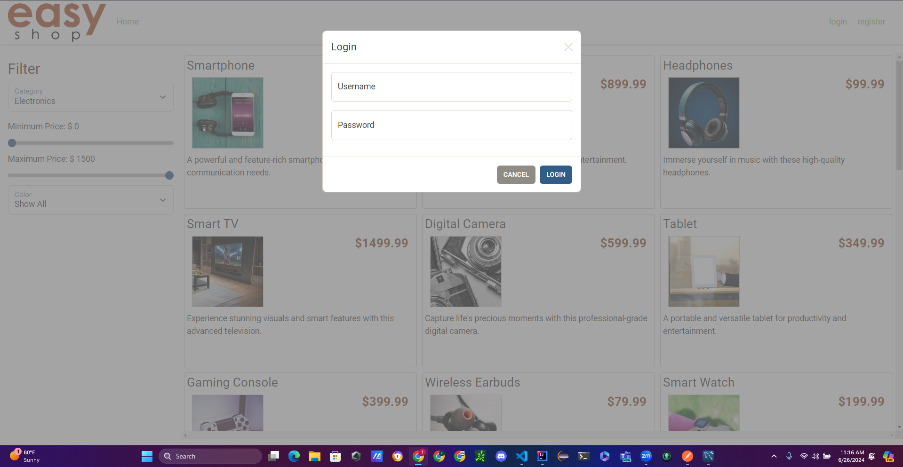
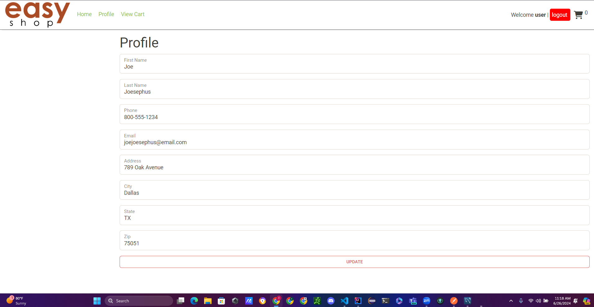
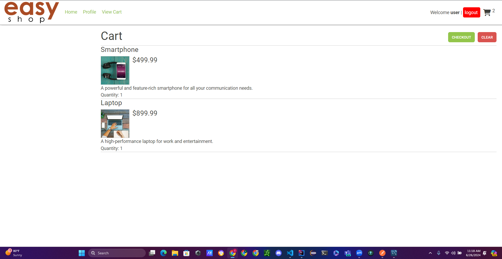
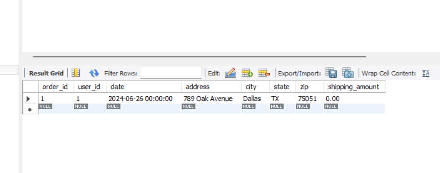
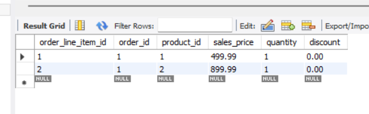

# Easy-shop-E-commerce-store

### Over view of the project
This project is a an online E-commerce store. The client server of the project is ready. My role in this project is to create the backend server to make the website full-stack. I created the backend of the project using Java spring boot to connect the API and to allow the client to fetch from the server. The client will send API request's to the server and the server will get the data that the client is asking for and return it. In this project the backend server is allowing user's to login/register as either (User, admin) using tokens that is unique to each user/admin. Below is a diagram of the backend MVC pattern.

## Diagram

([Link for diagram](https://lucid.app/lucidchart/0d55c612-f50c-4b17-9621-9e9d3adc7cc4/edit?viewport_loc=-1201%2C-1369%2C2994%2C1452%2C0_0&invitationId=inv_c38d4138-bce2-4911-960d-0b76ab51be17))

## Phase 1

Implemented all CRUD operation's for the category's controller using REST API's. The server recieves a localhost:8080 protocall to the categorys controller. The controller proccess the call and calls a function in the categoriesDao class depending what type of call it is,(GET, POST, PUT, DELETE) and who is making the call (admin or user).

## Phase 2

Implemeted all CRUD operations for the products and made responses for all the api filter protocalls, allowing user to search by category, price range, and also color. Also added admin tools like, create product, update, and delete product.

## Phase 3

Implemeted all CRUD operation for the shopping cart, allowing user add, clear, and update the shopping cart. The client sends a request to localhost:8080/cart and the shoppingCartController responsed depending on if the user is logged in and depending on the type of request. 

## Phase 4 

In this phase I created a controller to responed to the api calls that client make for the user profile. The api calls go to the profilesController and the profiles controller calls a method in profilesDao depending on the user's request (GET profile or Update profile). 

## Phase 5

In this phase the logic that I implemented is allowing the user to check out. Once the user goes to cart they're is an option for checking out. Once the user checks out, that cart will go back to empty and the order with get saved in the order table in mySql database.

# Pictures and descriptions



The categories list options allows the user to to filter through the products using the categories (Electronics, fashion, etc...).



Once the user chooses the category an api request will be sent to the backend. 



The backend application gets the request and a GET then calls productDao.ListByCategoryId which returns a list of products that get back to the controller. The list gets sent back as a response from the server to the client as an json String that gets transformed into html.

productsDao code example:
```java
@Override
    public List<Product> listByCategoryId(int categoryId)
    {
        List<Product> products = new ArrayList<>();

        String sql = "SELECT * FROM products " +
                    " WHERE category_id = ? ";

        try (Connection connection = getConnection())
        {
            PreparedStatement statement = connection.prepareStatement(sql);
            statement.setInt(1, categoryId);

            ResultSet row = statement.executeQuery();

            while (row.next())
            {
                Product product = mapRow(row);
                products.add(product);
            }
        }
        catch (SQLException e)
        {
            throw new RuntimeException(e);
        }

        return products;
    }
```

## Screens

### Register screen


In this screen once the user provides all the information needed to create an account an api GET Request "/register" will be sent to server in the authenticationController with a method register. 
The method will request for registerDto(data transger object) body.
A new user will be created with the user name, password, and it will check if the password is confirmed correctly. The password will be saved in the database as a hash. Down below is a code for the register api.

```java
@ResponseStatus(HttpStatus.CREATED)
    @RequestMapping(value = "/register", method = RequestMethod.POST)
    public ResponseEntity<User> register(@Valid @RequestBody RegisterUserDto newUser) {

        try
        {
            boolean exists = userDao.exists(newUser.getUsername());
            if (exists)
            {
                throw new ResponseStatusException(HttpStatus.BAD_REQUEST, "User Already Exists.");
            }

            // create user
            User user = userDao.create(new User(0, newUser.getUsername(), newUser.getPassword(), newUser.getRole()));

            // create profile
            Profile profile = new Profile();
            profile.setUserId(user.getId());
            profileDao.create(profile);

            return new ResponseEntity<>(user, HttpStatus.CREATED);
        }
        catch (Exception e)
        {
            throw new ResponseStatusException(HttpStatus.INTERNAL_SERVER_ERROR, "Oops... our bad.");
        }
    }
```

### Login screen


In the login screen once the user inputs the username and password and token will be created out of the user name and password. Once the token is created it will get passed to an the authentication. For the secuirty of this application i used Spring-secuirty JWT. Code for login api is below:
```java
@RequestMapping(value = "/login", method = RequestMethod.POST)
    public ResponseEntity<LoginResponseDto> login(@Valid @RequestBody LoginDto loginDto) {

        UsernamePasswordAuthenticationToken authenticationToken =
                new UsernamePasswordAuthenticationToken(loginDto.getUsername(), loginDto.getPassword());

        Authentication authentication = authenticationManagerBuilder.getObject().authenticate(authenticationToken);
        SecurityContextHolder.getContext().setAuthentication(authentication);
        String jwt = tokenProvider.createToken(authentication, false);

        try
        {
            User user = userDao.getByUserName(loginDto.getUsername());

            if (user == null) throw new ResponseStatusException(HttpStatus.NOT_FOUND);

            HttpHeaders httpHeaders = new HttpHeaders();
            httpHeaders.add(JWTFilter.AUTHORIZATION_HEADER, "Bearer " + jwt);
            return new ResponseEntity<>(new LoginResponseDto(jwt, user), httpHeaders, HttpStatus.OK);
        }
        catch(Exception ex)
        {
            throw new ResponseStatusException(HttpStatus.INTERNAL_SERVER_ERROR, "Oops... our bad.");
        }
    }
```

### Home screen


In the home screen, if the user is logged the user will be able to add product to cart and view the cart. The user is also allowed to search for product by price range, color and category. If the user doesn't change miniprice and maximum price they will be set to default as (MinPrice: 0, maxPrice: 1500). Code for the filter is down below:

```java
 // filtering products with category, minPrice, maxPrice, and color
    @Override
    public List<Product> search(Integer categoryId, BigDecimal minPrice, BigDecimal maxPrice, String color)
    {
        List<Product> products = new ArrayList<>();

        String sql = """
                SELECT * FROM products
                WHERE (category_id = ? OR ? = -1)
                AND (price BETWEEN ? AND ? OR ? = -1)
                AND (color = ? OR ? = '')
                """;

        categoryId = categoryId == null ? -1 : categoryId;
        minPrice = minPrice == null ? new BigDecimal("0") : minPrice; // if min price is null set it as 0
        maxPrice = maxPrice == null ? new BigDecimal("1500") : maxPrice; // if max price is null set it as 1500
        color = color == null ? "" : color; // if color is null set it to empty String

        try (Connection connection = getConnection())
        {
            PreparedStatement statement = connection.prepareStatement(sql);
            statement.setInt(1, categoryId);
            statement.setInt(2, categoryId);
            statement.setBigDecimal(3, minPrice);
            statement.setBigDecimal(4, maxPrice);
            statement.setBigDecimal(5, minPrice);
            statement.setString(6, color);
            statement.setString(7, color);

            ResultSet row = statement.executeQuery();

            while (row.next())
            {
                Product product = mapRow(row);
                products.add(product);
            }
        }
        catch (SQLException e)
        {
            throw new RuntimeException(e);
        }

        return products;
    }
    
```

### Profile screen


Once the user clicks on the profile screen they have the options to change they're profile information. Once the use clicks update, the server will get the username of the user that's logged with java princaple object and search for the user with userDao.Once the user been found an api PUT request will be sent to the server. The server will responed to the request and update the user profile information. Code for updating profile is below: 

* Controller
```java
// update profile with profile body
    @PutMapping("/profile")
    public void updateProfile(@RequestBody Profile profile, Principal principal)
    {
        try {
            String userName = principal.getName(); // getting user logged in
            User user = userDao.getByUserName(userName); // searching for user in database by username
            int userId = user.getId(); // getting user id
            profileDao.updateProfile(userId, profile);
        }
        catch (Exception e)
        {
            throw new ResponseStatusException(HttpStatus.BAD_REQUEST, "Oops...our fault");
        }
    }
```

* Dao
```java
// update profile with userId and profile body requested
    @Override
    public void updateProfile(int userId, Profile profile) {
        String sql = """
                UPDATE profiles
                SET first_name = ?
                    , last_name = ?
                    , phone = ?
                    , email = ?
                    , address = ?
                    , city = ?
                    , state = ?
                    , zip = ?
                WHERE user_id = ?;
                """;

        try(Connection connection = getConnection())
        {
                PreparedStatement preparedStatement = connection.prepareStatement(sql);
                preparedStatement.setString(1, profile.getFirstName());
                preparedStatement.setString(2, profile.getLastName());
                preparedStatement.setString(3, profile.getPhone());
                preparedStatement.setString(4, profile.getEmail());
                preparedStatement.setString(5, profile.getAddress());
                preparedStatement.setString(6, profile.getCity());
                preparedStatement.setString(7, profile.getState());
                preparedStatement.setString(8, profile.getZip());
                preparedStatement.setInt(9, userId);

                preparedStatement.executeUpdate();
        }
        catch (Exception e)
        {
            throw new RuntimeException(e);
        }
    }
```

### cart screen


The cart screen allows the user to check out products added or clear the cart. Once the user checks out the application will get the username of the user that logged in and search for the user in the user table to get the id. The order will be then be saved in the order table and the cart items will be saved in the order line table with the order id. The order table will also contain the userId. Code and examples of how the orders are saved is down below:





Code for saving order in the database: 

```java
    @Override
    public ShoppingCart addOrder(int userId) {
        // getting shopping cart by user id
        ShoppingCart shoppingCart = shoppingCartDao.getByUserId(userId);
        // getting user profile by user id from userDao
        Profile profile = profileDao.getProfile(userId);
        // shopping cart and user's info to shoppingCart
        Order order = mapToOrder(shoppingCart, profile);

        // inserting order
        String sql = """
                INSERT INTO orders
                (user_id, date, address, city, state, zip, shipping_amount)
                VALUES
                (?, ?, ?, ?, ?, ?, ?);
                """;
        try(Connection connection = getConnection())
        {
            PreparedStatement preparedStatement = connection.prepareStatement(sql);
            preparedStatement.setInt(1,order.getUserid());
            preparedStatement.setString(2, order.getDate());
            preparedStatement.setString(3, order.getAddress());
            preparedStatement.setString(4, order.getCity());
            preparedStatement.setString(5, order.getState());
            preparedStatement.setString(6, order.getZip());
            preparedStatement.setDouble(7, order.getShippingAmount());
            preparedStatement.executeUpdate();

            addOrderLineItem(userId, shoppingCart);
        }
        catch (Exception e)
        {
            throw new RuntimeException(e);
        }
        return shoppingCartDao.getByUserId(userId);
    }

    @Override
    public void addOrderLineItem(int userId, ShoppingCart shoppingCart) {
        // getting cartItem from shopping cart and converting it to list of map entry's
        List<Map.Entry<Integer, ShoppingCartItem>> shoppingCartItems = new ArrayList<>(shoppingCart.getItems().entrySet());
        Order order = getOrderByUserId(userId);

        String sql = """
                    INSERT INTO order_line_items
                    (order_id, product_id, sales_price, quantity, discount)
                    VALUES
                    (?, ?, ?, ?, ?)
                    """;

        // looping through the entry
        for (Map.Entry<Integer, ShoppingCartItem> entry : shoppingCartItems)
        {
            // getting the product id and cart item
            int productId = entry.getKey();
            ShoppingCartItem shoppingCartItem = entry.getValue();

            try(Connection connection = getConnection()) {
                PreparedStatement preparedStatement = connection.prepareStatement(sql);
                preparedStatement.setInt(1, order.getOrderId());
                preparedStatement.setInt(2, shoppingCartItem.getProductId());
                preparedStatement.setBigDecimal(3, shoppingCartItem.getLineTotal());
                preparedStatement.setInt(4, shoppingCartItem.getQuantity());
                preparedStatement.setBigDecimal(5, shoppingCartItem.getDiscountPercent());
                preparedStatement.executeUpdate();

                shoppingCart.clearItems();
                shoppingCartDao.clearCart(userId);
            }
            catch (Exception e)
            {
                throw new RuntimeException(e);
            }
        }
    }
```

## Peace of code that I am proud of

The most challenging part of this project was the shopping cart api. I started off by getting the data from the shoppingCart table and sending each shopping cart item one at a time and it wasn't working. I soon then found that the client is expecting a whole shopping cart object with all the item in a hashmap. The format of the shopping cart JSON is down below: 

```JSON
{
    "items": 
    { "1":
        {
            "product": {
            "productId": 1,
            "name": "Smartphone",
            "price": 499.99,
            "categoryId": 1,
            "description": "A powerful and feature- rich smartphone for all your communication needs.",
            "color": "Black",
            "stock": 50,
            "imageUrl": "smartphone.jpg", "featured": false
            },
        "quantity": 2,
        "discountPercent": 0,
        "lineTotal": 999.98
        }, "15": {
            "product": {
            "productId": 15,
            "name": "External Hard Drive",
            "price": 129.99,
            "categoryId": 1,
            "description": "Expand your storage capacity and backup your import ant files with this external hard drive.",
            "color": "Gray",
            "stock": 25,
            "imageUrl": "external-hard-drive.jpg", "featured": true
            },
        "quantity": 1,
        "discountPercent": 0,
        "lineTotal": 129.99
        }
    },
"total": 1129.97
}
```

Sample code of one of the cart CRUD operations:

```java
@Override
    public ShoppingCart addOrder(int userId) {
        // getting shopping cart by user id
        ShoppingCart shoppingCart = shoppingCartDao.getByUserId(userId);
        // getting user profile by user id from userDao
        Profile profile = profileDao.getProfile(userId);
        // shopping cart and user's info to shoppingCart
        Order order = mapToOrder(shoppingCart, profile);

        // inserting order
        String sql = """
                INSERT INTO orders
                (user_id, date, address, city, state, zip, shipping_amount)
                VALUES
                (?, ?, ?, ?, ?, ?, ?);
                """;
        try(Connection connection = getConnection())
        {
            PreparedStatement preparedStatement = connection.prepareStatement(sql);
            preparedStatement.setInt(1,order.getUserid());
            preparedStatement.setString(2, order.getDate());
            preparedStatement.setString(3, order.getAddress());
            preparedStatement.setString(4, order.getCity());
            preparedStatement.setString(5, order.getState());
            preparedStatement.setString(6, order.getZip());
            preparedStatement.setDouble(7, order.getShippingAmount());
            preparedStatement.executeUpdate();

            addOrderLineItem(userId, shoppingCart);
        }
        catch (Exception e)
        {
            throw new RuntimeException(e);
        }
        return shoppingCartDao.getByUserId(userId);
    }
```